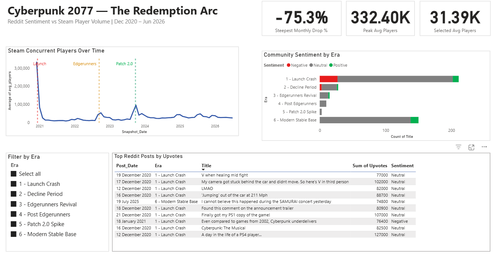

# Cyberpunk 2077 — The Redemption Arc Analytics Project

## Overview
This project analyzes one of gaming history's most dramatic comeback stories —
Cyberpunk 2077's journey from catastrophic launch to critical redemption.

It connects two data sources to answer one central question:
**Does online community sentiment actually predict real-world player behavior?**

## Research Questions
| # | Question | Period |
|---|----------|--------|
| 1 | Did the Dec 2020 launch crash show clearly in player numbers, and what was the community actually saying? | Dec 2020 – Jan 2021 |
| 2 | Is there a measurable recovery when Reddit sentiment shifted around Edgerunners and Patch 2.0? | Sep 2022, Sep 2023 |
| 3 | Where does the game stand today vs the historic launch window? | Jun 2026 |

## Key Findings
- Player count dropped **−75% in one month** after launch (332k → 82k avg players)
- Reddit reaction during the crash was dominated by **bug humor and memes**, not pure outrage
- Edgerunners anime (Sept 2022) drove a **+315% player spike** — confirmed by both data sources
- Patch 2.0 (Sept 2023) drove a further **+247% spike**, confirmed by Steam data
- The game maintains **24,000+ avg concurrent players in 2026** — stable for a single-player title

> 📄 Full findings, methodology, and interpretation → **[Notion Case Study](https://app.notion.com/p/Redemption-Arc-Cyberpunk-2077-Data-Case-Study-3858e213d259806e9a76c659f0af8c7e)**

---

## Tech Stack
| Tool | Purpose |
|------|---------|
| Python — requests, BeautifulSoup | Data extraction from SteamCharts + Reddit |
| Python — pandas | Data cleaning and transformation |
| SQLite | Structured storage and SQL analysis |
| Power BI | Interactive dashboard and visualization |

---

## Data Sources
| Source | Method | Volume |
|--------|--------|--------|
| SteamCharts (App ID: 1091500) | requests + pandas read_html | 67 months |
| Reddit r/cyberpunkgame | BeautifulSoup HTML scraping | 492 posts |

> **Data collected:** December 2020 — June 2026
> Dataset is frozen at collection date for reproducibility.

---

## Project Structure

```
cyberpunk_game_analysis/
├── data/
│   ├── raw/
│   │   ├── cyberpunk_players_count.csv
│   │   ├── cyberpunk_reddit_data.csv
│   │   └── cyberpunk_reddit_data_500.csv
│   └── staging/
│       ├── staging_steam_players.csv
│       ├── staging_reddit_community.csv
│       ├── staging_reddit_with_sentiment.csv
│       ├── powerbi_monthly_summary.csv
│       ├── powerbi_reddit_posts.csv
│       └── powerbi_steam_players.csv
├── database/
│   └── cyberpunk_analysis.db
├── report/
│   ├── cyberpunk_dashboard.pbix
│   ├── cyberpunk_report.pdf
│   └── cyberpunk_report_screenshot.png
├── scripts/
│   ├── 01_extract_steam_data.py
│   ├── 02_extract_reddit_data.py
│   ├── 03_clean_steam.py
│   ├── 04_clean_reddit.py
│   ├── 05_load_to_sqlite.py
│   ├── 06_sentiment_tagging.py
│   └── 07_export_for_powerbi.py
├── sql/
│   └── analysis_queries.sql
├── .gitignore
└── README.md
```

---

## How to Explore This Project

All data is already collected and included in this repository.
No re-scraping needed.

```bash
# Step 1 — rebuild the database from cleaned CSVs
python scripts/05_load_to_sqlite.py

# Step 2 — apply sentiment tags
python scripts/06_sentiment_tagging.py
```

Then open `database/cyberpunk_analysis.db` in any SQLite viewer
and run queries from `sql/analysis_queries.sql`.

Open `report/Cyberpunk_Analytics Report.pbix` in Power BI Desktop to view the report.

> **Note on re-extraction:** The extraction scripts (01 and 02) are included
> for transparency only. Re-running script 02 scrapes Reddit's public pages
> and is subject to Reddit's terms of service. It is not recommended to
> re-run extraction unless you have a specific reason to collect fresh data.

---

## Known Limitations

- **Reddit ranking bias** — all-time top ranking favors older posts; launch era (Dec 2020) dominates with 128 of 492 posts
- **Sentiment tagging** — keyword-based classifier; sarcasm and gaming slang may occasionally misclassify
- **Steam partial month** — most recent row is a rolling 30-day window, not a full calendar month

---

## Dashboard Preview




>  open in Power BI Desktop to explore

---

## About

Built by **Dhanashri Karve** as a portfolio project demonstrating a complete
end-to-end data analytics project.

